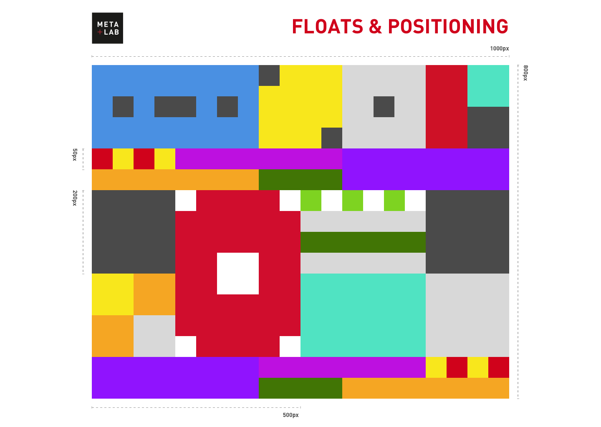

# Floats-and-Positioning -- SASS and BEM edition!
Original challenge issued by <a href="https://github.com/csun-metalab/awesome-metalab" target="blank">META+LAB</a> to be done before being considered into their summer internship program in 2017. 
Original challenge required plain HTML and CSS, and my version of the original challenge can be found [here](https://github.com/aprilLima/Floats-and-Positioning). 

I re-explored this challenge on my own time to practice implementing [SASS](https://sass-lang.com/) and practice the [BEM](http://getbem.com/) naming conventions. 

## Objective
The original objective for the project is to implement this image of colored squares into plain HTML and CSS:

My personal new objective for this project was to implement the image using SASS and BEM. 

* _Note that this personal project was done simply to practice SASS and BEM._
